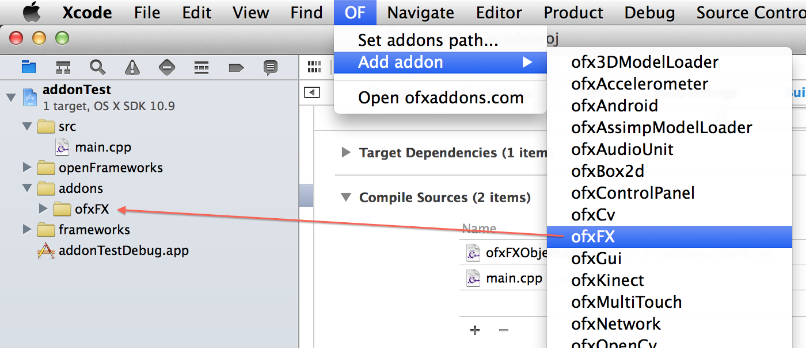

OFXcodeMenu
========
(formerly OFPlugin)

[OpenFrameworks](http://openframeworks.cc) plugin for Xcode that adds addons to your project. Compatible with Xcode 5 - 7 on OS X 10.8+. `HEAD` of this repo is typically paired with the latest Xcode. For older Xcode releases, see the git tags or just checkout OFXcodeMenu at the relevant point in time. 



Installing
==========

*Building the included Xcode project will install the plugin*

To control installation manually, add/remove OFXcodeMenu.xcplugin in:

    ~/Library/Application Support/Developer/Shared/Xcode/Plug-ins/OFXcodeMenu.xcplugin

You may need to create a few of the directories on the way, as they don't all exist by default.

The plugin can also be installed via the [Alcatraz](http://alcatraz.io/) Xcode package manager.

Known Issues
============

When addons contain static libs, they will be added with absolute paths. This is due to a quirk in the Xcode API being used by OFXcodeMenu. If you intend to share a project with other people, it is recommended that you re-add static libs yourself (by right-clicking in the project navigator and selecting "Add Files To (project name)...", for example). You can also edit the project's .pbxproj file yourself if you're feeling brave.

Troubleshooting
===============

**"I updated Xcode and now the plugin doesn't show up"**

Xcode works on a UUID whitelist system, meaning each new version of Xcode needs to have its UUID added to OFXcodeMenu's Info.plist file. If OFXcodeMenu isn't updated in time, you can do this update yourself (and by all means send a pull request afterwards!).

Get the UUID by running the following in the terminal:

```
defaults read /Applications/Xcode.app/Contents/Info DVTPlugInCompatibilityUUID
```
Then, open the OFXcodeMenu project and edit the Supporting Files > OFXcodeMenu-Info.plist file. You'll need to add the UUID you just copied to the DVTPlugInCompatibilityUUIDs section.

Rebuild the plugin, restart Xcode and you should see the OF menu reappear.

**"I want to use this plugin with non-latest Xcode"**

OFXcodeMenu has been kept in sync with Xcode starting from Xcode 5, though only the latest Xcode is supported by github HEAD. To use with an older Xcode, you will have to checkout to an older OFXcodeMenu commit and rebuild.

**"The plugin isn't adding my addon correctly"**

The plugin parses addons_config.mk and will use it to tell which system frameworks to add, which folders to ignore, extra includes to add, etc. Example folders are always ignored by default. It will also use some of the metadata, such as the dependency list and addon url. If your addon doesn't work with OFXcodeMenu properly out-of-the-box, you should add an addon_config.mk. See ofxKinect and ofxMidi for examples.

If OFXcodeMenu doesn't seem to be parsing your addon_config.mk properly, please [open an issue](https://github.com/openframeworks/OFXcodeMenu/issues).
